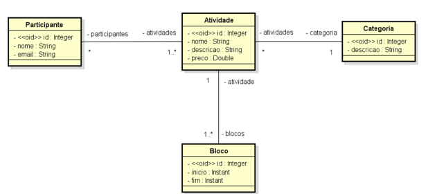

# Projeto_Eventos
Este é o README do projeto "Eventos", um sistema desenvolvido em Java com o framework Spring que permite gerenciar eventos, participantes, atividades, categorias e blocos relacionados.

# Funcionalidades
O sistema "Eventos" possui as seguintes funcionalidades:

Cadastro de participantes: Os usuários podem se cadastrar no sistema fornecendo informações como nome e e-mail.

Gerenciamento de atividades: Os organizadores do evento podem criar atividades relacionadas ao evento, atribuir categorias a essas atividades e agendar blocos de tempo para cada atividade.

Categorização de atividades: As atividades podem ser associadas a categorias específicas, como "Palestras", "Workshops" ou "Apresentações".

Agendamento de blocos: Para cada atividade, é possível agendar um ou mais blocos de tempo, determinando a data, a hora de início e a hora de término.
# UML

# Requisitos de instalação
Para executar o projeto "Eventos", você precisará ter o Java JDK e o Maven instalados em sua máquina local.

